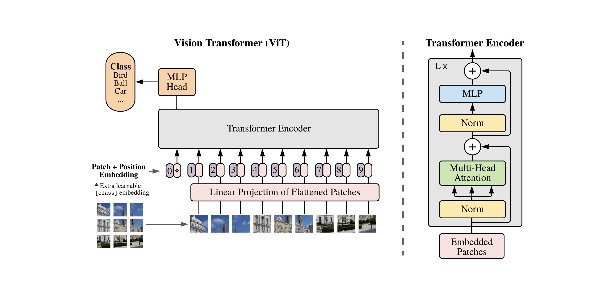
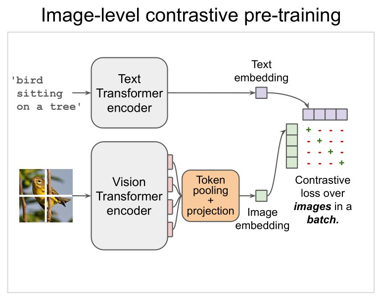
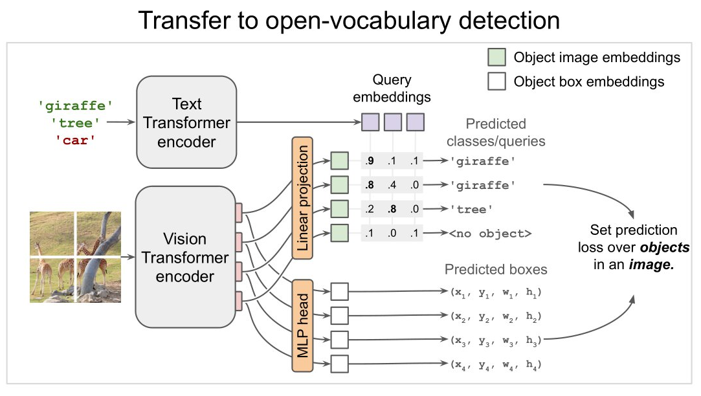

# NanoOWL Detection System

This project implements a real-time detection system using **NanoOWL**, a lightweight model optimized for real-time detections through a **.engine** TensorRT engine. NanoOWL allows open-vocabulary detections, which means it can locate objects by simply describing them in natural language, even if they were not seen during training.

---

## 🦉 **What is OWL-ViT?**

OWL-ViT (Open-Vocabulary Learning Vision Transformer) is a multimodal object detection model designed to locate objects in images using natural language descriptions. Unlike traditional detectors limited to a fixed set of classes, OWL-ViT can identify objects not explicitly trained for by interpreting textual descriptions.

---

## 🔎 **Vision Transformers (ViT)**

Vision Transformers (ViT) are a neural network architecture designed for computer vision tasks. Unlike convolutional networks, ViT divides an image into small sections called *patches* and applies a Transformer model to capture relationships between these sections.

* **Patches:** The image is divided into small blocks (e.g., 16x16 pixels).
* **Embedding:** Each patch is converted into a feature vector.
* **Positional Encoding:** Positional information is added to preserve spatial structure.
* **Transformer Encoder:** A set of self-attention blocks that capture global relationships in the image.
<div align="center">
  
</div>

---

## **OWL-ViT: Training and Inference Process**

OWL-ViT follows three fundamental stages as illustrated in the provided image:

### 1️⃣ **Image-level Contrastive Pre-training**

The model is trained to align visual and textual representations in a shared latent space. In this phase:

* The *Text Transformer Encoder* processes natural language descriptions (e.g., 'bird sitting on a tree').
* The *Vision Transformer Encoder* processes an image into *patches*, generating a visual embedding.
* Both embeddings (*text and image*) are optimized with a *Contrastive Loss*, maximizing similarity between related pairs (image-text) and minimizing unrelated ones.
<div align="center">
  
</div>

---

### 2️⃣ **Transfer to Open-Vocabulary Detection**

Once the latent spaces are aligned, OWL-ViT can detect objects in images using textual descriptions. The process is as follows:

* Textual descriptions (*queries*) are converted into embeddings via the *Text Transformer Encoder*.
* Image regions are represented by the *Vision Transformer Encoder*.
* Visual embeddings are projected into potential bounding boxes.
* An MLP Head adjusts the final coordinates of each detected box.
<div align="center">
  
</div>

---

### 3️⃣ **Multimodal Inference**

In this phase, OWL-ViT receives two inputs:

* An image.
* A list of natural language descriptions (*queries*).

The model compares visual embeddings with textual ones. If a match is found, a *bounding box* is assigned to the identified object along with a confidence score. This process enables object localization in the image by simply describing them in natural language, even if they were not seen during training.

<div align="center">
  
</div>

---

## 🛠️ **Clone and build**

```bash
cd ~/ros2_ws/src
git clone https://github.com/RubenCasal/owl_vit_detetor.git
cd ~/ros2_ws
colcon build --packages-select owl_vit_detector
source install/setup.bash
```

---
## ROS 2 Usage

### Run Nodes Separately

1️⃣ Launch the camera node:

```bash
ros2 run owl_vit_detector theta_driver
```

2️⃣ Launch the detection node:

```bash
ros2 run owl_vit_detector owl_detector.py
```

3️⃣ Change the query in real-time:

```bash
ros2 topic pub /input_query std_msgs/String "data: 'a person, a car, a bike'"
```

You can specify the objects you want to detect, separated by commas.

### Launch Files

Alternatively, use launch files:

```bash
ros2 launch owl_vit_detector owl_vit_launch.py
```
---

##  **Published Topics**


| Topic Name              | Type                | Direction | Description                               |
| ----------------------- | ------------------- | --------- | ----------------------------------------- |
| `/stitched_image`       | `sensor_msgs/Image` | Sub       | Input panorama from Ricoh Theta Z1        |
| `/stitched_image_annotated` | `sensor_msgs/Image` | Pub       | Annotated image with detections.    |
| `/output_detections`          | ` vision_msgs/msg/Detection2DArray` | Pub       |  List of detections in ROS 2 format. |


---

## ✅ **Advantages and Applications**

* **Auto-labeling for datasets:** Thanks to its open-vocabulary detection capability, NanoOWL allows automatic image labeling by simply describing the objects to be detected.
* **Detection in dynamic environments:** It is not limited to a fixed set of classes, making it ideal for scenarios where objects change constantly.
* **Easy integration in ROS 2 pipelines:** The model publishes to ROS 2 topics, enabling its use in robotics and computer vision applications without major changes.

---

## ⚠️ **Limitations**

* **Heavy model:** Even though it is the 'Nano' version, its size is still considerable for low-resource embedded systems.
* **Limited open-vocabulary detection:** The free-vocabulary detections are accurate, but not as robust as in larger models due to parameter reduction.

---
